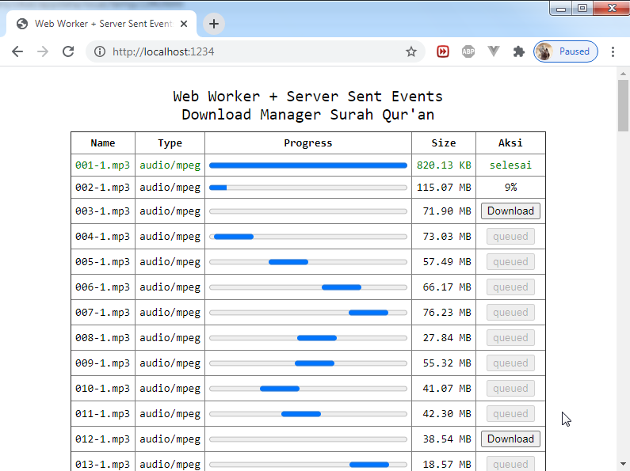

# Web Worker + Server Sent Events + PHP Stream



Studi kasus di repo ini, Download Manager Surah Qur'an.

Teknologi yang digunakan :

* Web Worker
* HTML5 Server Sent Events (SSE)
* PHP Stream Event

Ini adalah eksplorasi lanjutan dari repo saya sebelumnya <a href="https://github.com/cikaldev/latihan1" target="_blank">https://github.com/cikaldev/latihan1</a>, kali ini saya taburkan bumbu teknologi yang **asem-asem kecut** biar seger.. ahhaha..

Konsepnya "**Jangan Load Gajah di Main Thread**" manfaat kan background script (**web worker**) untuk meng-Handle Gajah itu, agar terhindar dari knock / Error Timeout..

Sukar sakit bikin aplikasi web kekinian, apalagi dengan minim nya minat baca rekan-rekan sebangsa kalong. Untuk tetap mengikuti perkembangan agar tak tertinggal oleh teknologi itu sendiri, monggo silahkan di seruput dan di intip, lalu di modif sesuai kebutuhan. Jangan lupa klik Star Repo nya biar saya lebih semangat.. :p

## JANGAN LUPA BISMILLAH

## Instalasi

Ga ada acara download2 dependencies, semua di buat pake kode native (PHP, JS, CSS, HTML5).

Cukup clone repo ini, kemudian lanjut baca nya..

## Running

Jalankan php built-in server di folder ini, klo di drop di xampp / wamp secara langsung. Otomatis anda harus benerin path ke asset static nya.

pada ga pengen ribet kan? sama saya juga.. :p

buka CMD / Bash di folder ini, lalu ketik:

```bash
php -S localhost:1234 -t .

# atau

composer start
```

Silahkan akses url nya `http://localhost:1234` via browser.

Semoga bermanfaat.

<br>

Credit :

* Quran Audio diambil dari link berikut: <a href="https://download.quranicaudio.com" target="_blank">https://download.quranicaudio.com</a>